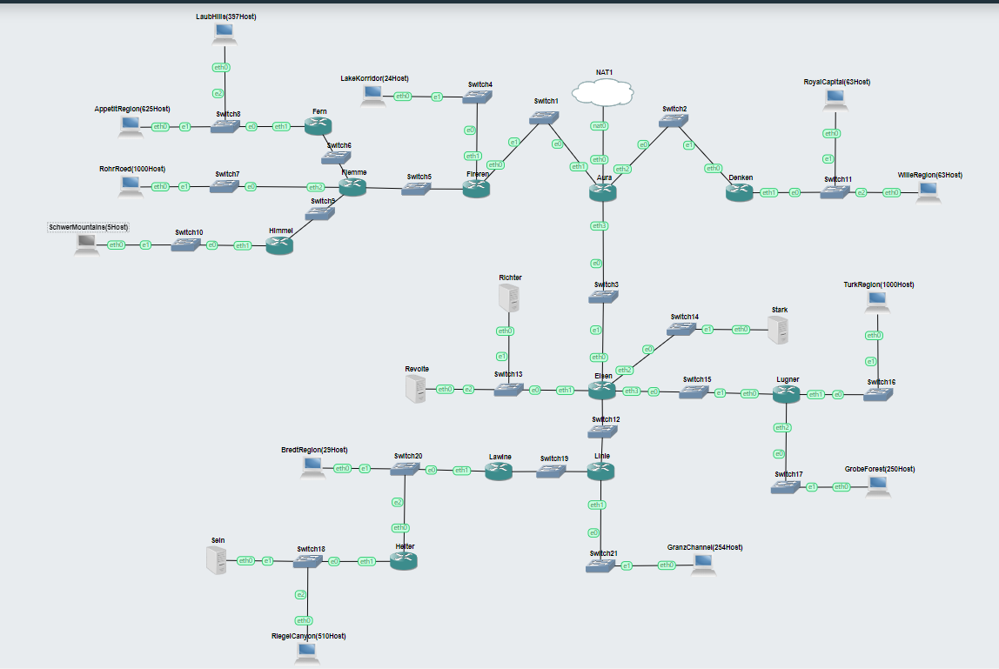
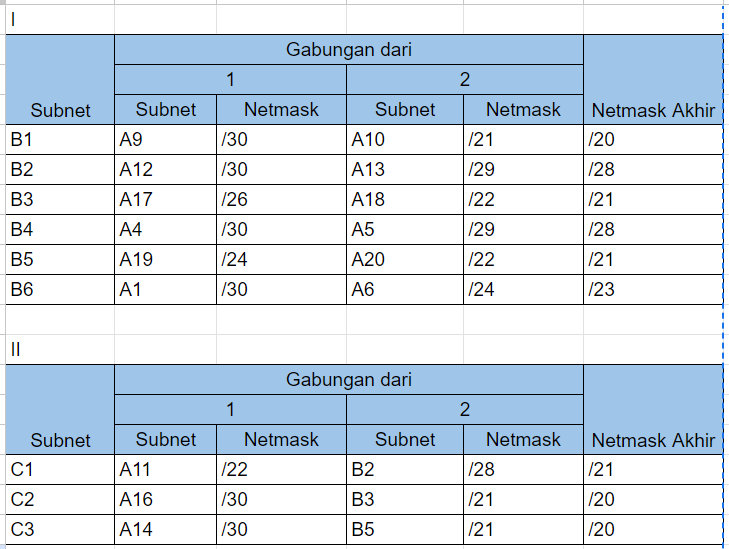
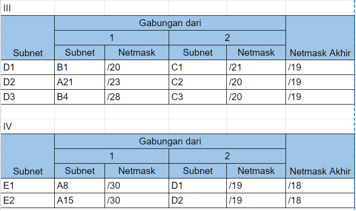
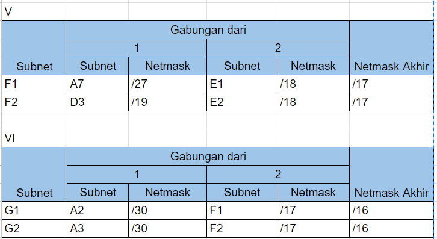
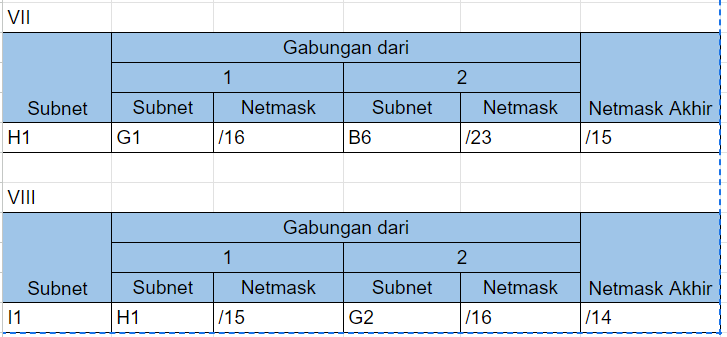
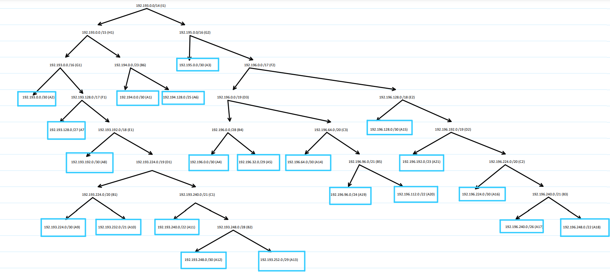
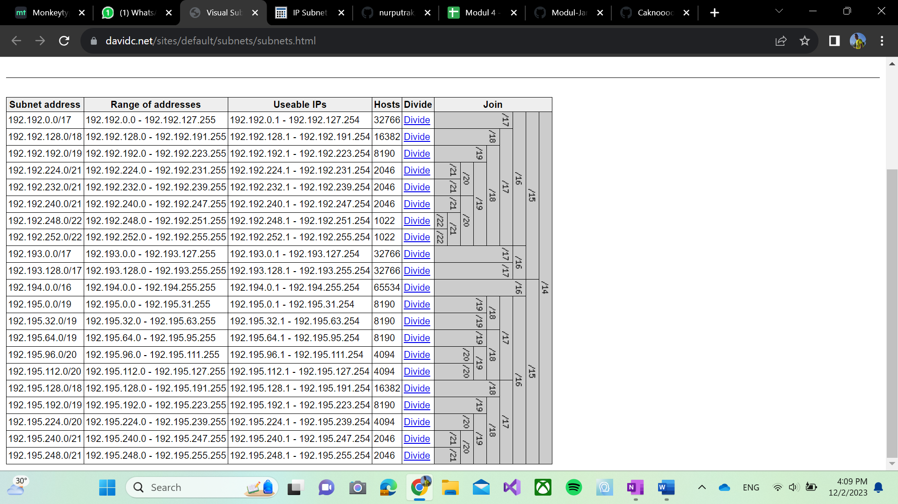
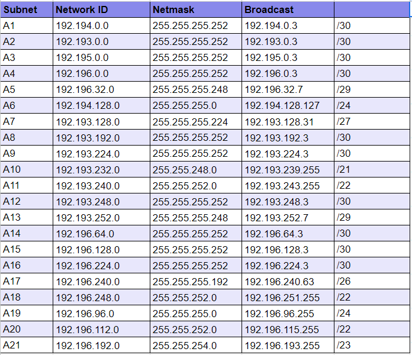

# Jarkom-Modul-4-D04-2023
# Anggota Kelompok
|                Nama                |    NRP     |
| :--------------------------------: | :--------: |
|       Muhammad Rafi Sutrisno       | 5025211167 |
|      Nadira Milha Nailul Fath      | 5025211253 |
## Soal
1. Soal shift dikerjakan pada Cisco Packet Tracer dan GNS3 menggunakan metode perhitungan CLASSLESS yang berbeda.
Keterangan: Bila di CPT menggunakan VLSM, maka di GNS3 menggunakan CIDR atau sebaliknya
2. Jika tidak ada pemberitahuan revisi soal dari asisten, berarti semua soal BERSIFAT BENAR dan DAPAT DIKERJAKAN.
3. Untuk di GNS3 CLOUD merupakan NAT1 jangan sampai salah agar bisa terkoneksi internet.
4. Pembagian IP menggunakan Prefix IP yang telah ditentukan pada modul pengenalan
5. Pembagian IP dan routing harus SE-EFISIEN MUNGKIN.
## VLSM
### Topologi
Cisco Packet Tracer

Berikut Merupakan tree VLSM

### Pembagian IP

### Subnetting & Routing
- Aura
  ```
  FastEthernet0/1 : 192.193.0.9
  Ethernet1/0 	: 192.193.0.2
  Ethernet1/1	: 192.193.0.5
  ```
  Static
  ```
  0.0.0.0/0 via 192.193.0.1
  0.0.0.0/0 via 192.193.0.6
  0.0.0.0/0 via 192.193.0.10
  192.193.0.0/30 via 192.193.0.1
  192.193.0.4/30 via 192.193.0.6
  192.193.0.8/30 via 192.193.0.10
  ```
- Denken
  ```
  FastEthernet0/0 : 192.193.0.1
  FastEthernet0/1 : 192.193.3.1
  ```
  Static
  ```
  0.0.0.0/0 via 192.193.0.2
  192.193.0.0/30 via 192.193.0.2
  ```
- Frieren
  ```
  FastEthernet0/0 : 192.193.0.6
  FastEthernet0/1 : 192.193.0.97
  FastEthernet1/0 : 192.193.0.17
  ```
  Static
  ```
  0.0.0.0/0 via 192.193.0.5
  0.0.0.0/0 via 192.193.0.18
  192.193.0.4/30 via 192.193.0.5
  192.193.0.16/30 via 192.193.0.18
  ```
- Eisen
  ```
  FastEthernet0/0 : 192.193.0.10
  FastEthernet0/1 : 192.193.0.49
  Ethernet1/0	  : 192.193.0.29
  Ethernet1/1	  : 192.193.0.33
  Ethernet1/2	  : 192.193.0.13
  ```  
  Static
  ```
  0.0.0.0/0 via 192.193.0.9
  0.0.0.0/0 via 192.193.0.30
  0.0.0.0/0 via 192.193.0.34
  192.193.0.8/30 via 192.193.0.9
  192.193.0.28/30 via 192.193.0.30
  192.193.0.32/30 via 192.193.0.34
  ```
- Fern
  ```
  FastEthernet0/0 : 192.193.0.22
  FastEthernet0/1 : 192.193.24.1
  ```
  Static
  ```
  0.0.0.0/0 via 192.193.0.21
  192.193.0.20/30 via 192.193.0.21
  ```
- Flamme
  ```
  FastEthernet0/0 : 192.193.0.18
  FastEthernet0/1 : 192.193.0.21
  FastEthernet1/0 : 192.193.12.1
  FastEthernet1/1 : 192.193.0.25
  ```
  Static
  ```
  0.0.0.0/0 via 192.193.0.17
  0.0.0.0/0 via 192.193.0.22
  0.0.0.0/0 via 192.193.0.26
  192.193.0.16/30 via 192.193.0.17
  192.193.0.20/30 via 192.193.0.22
  192.193.0.24/30 via 192.193.0.26
  ```
- Himmel
  ```
  FastEthernet0/0 : 192.193.0.26
  FastEthernet0/1 : 192.193.0.57
  ```
  Static
  ```
  0.0.0.0/0 via 192.193.0.25
  192.193.0.24/30 via 192.193.0.25
  ```
- Lugner
  ```  
  FastEthernet0/0 : 192.193.0.30
  FastEthernet0/1 : 192.193.4.1
  FastEthernet1/0 : 192.193.20.1
  ```
  Static
  ```
  0.0.0.0/0 via 192.193.0.29
  192.193.0.28/30 via 192.193.0.29
  ```
- Linie
  ```
  FastEthernet0/0 : 192.193.0.34
  FastEthernet0/1 : 192.193.0.37
  FastEthernet1/0 : 192.193.8.1
  ```
  Static
  ```
  0.0.0.0/0 via 192.193.0.33
  0.0.0.0/0 via 192.193.0.38
  192.193.0.32/30 via 192.193.0.33
  192.193.0.36/30 via 192.193.0.38
  ```
- Lawine
  ```
  FastEthernet0/0 : 192.193.0.38
  FastEthernet0/1 : 192.193.1.1
  ```
  Static
  ```
  0.0.0.0/0 via 192.193.0.37
  0.0.0.0/0 via 192.193.1.3
  192.193.0.36/30 via 192.193.0.37
  192.193.1.0/27 via 192.193.1.3
  ```
- Heiter
  ```
  FastEthernet0/0 : 192.193.1.3
  FastEthernet0/1 : 192.193.16.1
  ```
  Static
  ```
  0.0.0.0/0 via 192.193.1.1
  192.193.1.0/27 via 192.193.1.1
  ```
- Client RoyalCapital (63 Host)
  ```
  gateaway : 192.193.3.1
  IP	   : 192.193.3.2
  Netmask  : 255.255.255.128
  ```
- Client WilleRegion (63 Host)
  ```
  gateaway : 192.193.3.1
  IP	   : 192.193.3.3
  Netmask  : 255.255.255.128
  ```
- Server Stark
  ```
  gateaway : 192.193.0.13
  IP	   : 192.193.0.14
  Netmask  : 255.255.255.252
  ```
- Client TurkRegion (1000 Host)
  ```
  gateaway : 192.193.20.1
  IP	   : 192.193.20.2
  Netmask  : 255.255.252.0
  ```
- Client GrobeForest (250 Host)
  ```  
  gateaway : 192.193.4.1
  IP	   : 192.193.4.2
  Netmask  : 255.255.255.0
  ```
- Server Richter
  ```
  gateaway : 192.193.0.49
  IP	   : 192.193.0.50
  Netmask  : 255.255.255.248
  ```
- Server Revolte
  ```
  gateaway : 192.193.0.49
  IP	   : 192.193.0.51
  Netmask  : 255.255.255.248
  ```
- Client LaubHills (397 Host)
  ```
  gateaway : 192.193.24.1
  IP	   : 192.193.24.2
  Netmask  : 255.255.252.0
  ```
- Client AppetitRegion (625 Host)
  ```
  gateaway : 192.193.24.1
  IP	   : 192.193.25.145
  Netmask  : 255.255.252.0
  ```
- Client RohrRoad (1000 Host)
  ```
  gateaway : 192.193.12.1
  IP	   : 192.193.12.2
  Netmask  : 255.255.252.0
  ```
- Client SchwerMountains (5 Host)
  ```
  gateaway : 192.193.0.57
  IP	   : 192.193.0.58
  Netmask  : 255.255.255.248
  ```
- Client GranzChannel (254 Host)
  ```
  gateaway : 192.193.8.1
  IP	   : 192.193.8.2
  Netmask  : 255.255.255.0
  ```
- Client RiegelCanyon (510 Host)
  ```
  gateaway : 192.193.16.1
  IP	   : 192.193.16.3
  Netmask  : 255.255.252.0
  ```
- Server Sein
  ```
  gateaway : 192.193.16.1
  IP	   : 192.193.16.2
  Netmask  : 255.255.252.0
  ```
- Client BredtRegion (29 Host)
  ```
  gateaway : 192.193.1.1
  IP	   : 192.193.1.2
  Netmask  : 255.255.255.224
  ```
### Testing
Testing pada :
Sein - Richter
GranzChannel - Turk Region
RiegelCanyon - Aura

## CIDR

Untuk perhitungan cidr kami menggunakan gns. Berikut adalah foto topologi :


Berikutnya dilakukan penggabungan subnet. Penggabungan saya menggabungkan semua kemungkinan subnet yang bisa digabungkan pada setiap iterasi.
Berikut adalah tabel penggabungan nya :






Selanjutnya membuat tree, berikut adalah tree nya :


Ip didapatkan dari calculator berikut :


Selanjutnya didapatkan network id, netmask, dan broadcast dari masing masing subnet seperti berikut :


Lalu lakukan konfigurasi pada masing masing node sesuai dengan ip yang telah didapatkan.
Berikut adalah konfigurasi masing masing node :

AURA
```
auto eth0
iface eth0 inet dhcp
up iptables -t nat -A POSTROUTING -o eth0 -j MASQUERADE -s 192.193.0.0/14

auto eth1
iface eth1 inet static
	address 192.193.0.1
	netmask 255.255.255.252

auto eth2
iface eth2 inet static
	address 192.194.0.1
	netmask 255.255.255.252

auto eth3
iface eth3 inet static
	address 192.195.0.1
	netmask 255.255.255.252
```

FRIEREN
```
auto eth0
iface eth0 inet static
	address 192.193.0.2
	netmask 255.255.255.252
	gateway 192.193.0.1
	up echo nameserver 192.168.122.1 > /etc/resolv.conf

auto eth1
iface eth1 inet static
	address 192.193.128.1
	netmask 255.255.255.224

auto eth2
iface eth2 inet static
	address 192.193.192.1
	netmask 255.255.255.252
```
FLAMME
```
auto eth0
iface eth0 inet static
	address 192.193.192.2
	netmask 255.255.255.252
	gateway 192.193.192.1
	up echo nameserver 192.122.168.1 > /etc/resolv.conf

auto eth1
iface eth1 inet static
	address 192.193.224.1
	netmask 255.255.255.252

auto eth2
iface eth2 inet static
	address 192.193.240.1
	netmask 255.255.252.0

auto eth3
iface eth3 inet static
	address 192.193.248.1
	netmask 255.255.255.252
```
FERN
```
auto eth0
iface eth0 inet static
	address 192.193.224.2
	netmask 255.255.255.252
	gateway 192.193.224.1
	up echo nameserver 192.168.122.1 > /etc/resolv.conf

auto eth1
iface eth1 inet static
	address 192.193.232.1
	netmask 255.255.248.0
```
HIMMEL
```
auto eth0
iface eth0 inet static
	address 192.193.248.2
	netmask 255.255.255.252
	gateway 192.193.248.1
	up echo nameserver 192.168.122.1 > /etc/resolv.conf

auto eth1
iface eth1 inet static
	address 192.193.252.1
	netmask 255.255.255.248
```
EISEN
```
auto eth0
iface eth0 inet static
	address 192.195.0.2
	netmask 255.255.255.252
	gateway 192.195.0.1
	up echo nameserver 192.168.122.1 > /etc/resolv.conf

auto eth1
iface eth1 inet static
	address 192.196.32.1
	netmask 255.255.255.248

auto eth2
iface eth2 inet static
	address 192.196.0.1
	netmask 255.255.255.252

auto eth3
iface eth3 inet static
	address 192.196.64.1
	netmask 255.255.255.252

auto eth4
iface eth4 inet static
	address 192.196.128.1
	netmask 255.255.255.252
```
LINIE
```
auto eth0
iface eth0 inet static
	address 192.196.128.2
	netmask 255.255.255.252
	gateway 192.196.128.1
	up echo nameserver 192.168.122.1 > /etc/resolv.conf

auto eth1
iface eth1 inet static
	address 192.196.192.1
	netmask 255.255.254.0

auto eth2
iface eth2 inet static
	address 192.196.224.1
	netmask 255.255.255.252
```
LAWINE
```
auto eth0
iface eth0 inet static
	address 192.196.224.2
	netmask 255.255.255.252
	gateway 192.196.224.1
	up echo nameserver 192.168.122.1 > /etc/resolv.conf

auto eth1
iface eth1 inet static
	address 192.196.240.1
	netmask 255.255.255.192
```
HEITER
```
auto eth0
iface eth0 inet static
	address 192.196.240.2
	netmask 255.255.255.192
	gateway 192.196.240.1
	up echo nameserver 192.168.122.1 > /etc/resolv.conf

auto eth1
iface eth1 inet static
	address 192.196.248.1
	netmask 255.255.252.0
```
LUGNER
```
auto eth0
iface eth0 inet static
	address 192.196.64.2
	netmask 255.255.255.252
	gateway 192.196.64.1
	up echo nameserver 192.168.122.1 > /etc/resolv.conf

auto eth1
iface eth1 inet static
	address 192.196.112.1
	netmask 255.255.252.0

auto eth2
iface eth2 inet static
	address 192.196.96.1
	netmask 255.255.255.0
```

DANKEN
```
auto eth0
iface eth0 inet static
	address 192.194.0.2
	netmask 255.255.255.252
	gateway 192.194.0.1
	up echo nameserver 192.168.122.1 > /etc/resolv.conf

auto eth1
iface eth1 inet static
	address 192.194.128.1
	netmask 255.255.255.128
```

LAKEKORIDOR
```
auto eth0
iface eth0 inet static
	address 192.193.128.2
	netmask 255.255.255.224
	gateway 192.193.128.1
	up echo nameserver 192.168.122.1 > /etc/resolv.conf
```
LAUBHILLS
```
auto eth0
iface eth0 inet static
	address 192.193.232.2
	netmask 255.255.255.224
	gateway 192.193.232.1
	up echo nameserver 192.168.122.1 > /etc/resolv.conf
```
APETITREGION
```
auto eth0
iface eth0 inet static
	address 192.193.232.3
	netmask 255.255.255.224
	gateway 192.193.232.1
	up echo nameserver 192.168.122.1 > /etc/resolv.conf
```
ROHRROAD
```
auto eth0
iface eth0 inet static
	address 192.193.240.2
	netmask 255.255.252.0
	gateway 192.193.240.1
	up echo nameserver 192.168.122.1 > /etc/resolv.conf
```
SCHWERMOUNTAINS
```
auto eth0
iface eth0 inet static
	address 192.193.252.2
	netmask 255.255.255.248
	gateway 192.193.252.1
	up echo nameserver 192.168.122.1 > /etc/resolv.conf
```
RICHTER
```
auto eth0
iface eth0 inet static
	address 192.196.32.2
	netmask 255.255.255.248
	gateway 192.196.32.1
	up echo nameserver 192.168.122.1 > /etc/resolv.conf
```
REVOLTE
```
auto eth0
iface eth0 inet static
	address 192.196.32.3
	netmask 255.255.255.248
	gateway 192.196.32.1
	up echo nameserver 192.168.122.1 > /etc/resolv.conf
```
BREDREGION
```
auto eth0
iface eth0 inet static
	address 192.196.240.2
	netmask 255.255.255.192
	gateway 192.196.240.1
	up echo nameserver 192.168.122.1 > /etc/resolv.conf
```
SEIN
```
auto eth0
iface eth0 inet static
	address 192.196.248.2
	netmask 255.255.252.0
	gateway 192.196.248.1
	up echo nameserver 192.168.122.1 > /etc/resolv.conf
```
REIGELCANYON
```
auto eth0
iface eth0 inet static
	address 192.196.248.3
	netmask 255.255.252.0
	gateway 192.196.248.1
	up echo nameserver 192.168.122.1 > /etc/resolv.conf
```
GRANZCHANNEL
```
auto eth0
iface eth0 inet static
	address 192.196.192.2
	netmask 255.255.254.0
	gateway 192.196.192.1
	up echo nameserver 192.168.122.1 > /etc/resolv.conf
```
GROBEFOREST
```
auto eth0
iface eth0 inet static
	address 192.196.96.2
	netmask 255.255.255.0
	gateway 192.196.96.1
	up echo nameserver 192.168.122.1 > /etc/resolv.conf
```
TURKREGION
```
auto eth0
iface eth0 inet static
	address 192.196.112.2
	netmask 255.255.252.0
	gateway 192.196.112.1
	up echo nameserver 192.168.122.1 > /etc/resolv.conf
```
STARK
```
auto eth0
iface eth0 inet static
	address 192.196.0.2
	netmask 255.255.252.0
	gateway 192.196.0.1
	up echo nameserver 192.168.122.1 > /etc/resolv.conf
```
WILEREGION
```
auto eth0
iface eth0 inet static
	address 192.194.128.2
	netmask 255.255.255.128
	gateway 192.194.128.1
	up echo nameserver 192.168.122.1 > /etc/resolv.conf
```
ROYALCAPITAL
```
auto eth0
iface eth0 inet static
	address 192.194.128.3
	netmask 255.255.255.128
	gateway 192.194.128.1
	up echo nameserver 192.168.122.1 > /etc/resolv.conf
```

Selanjutnya setelah melakukan konfigurasi pada masing masing node, lakukan routing agar semua node terhubung. 
Berikut adalah scicpt untuk routing :

AURA
```
#Kiri
route add -net 192.193.128.0 netmask 255.255.255.224 gw 192.193.0.2
route add -net 192.193.192.0 netmask 255.255.255.252 gw 192.193.0.2
route add -net 192.193.224.0 netmask 255.255.255.252 gw 192.193.0.2 
route add -net 192.193.232.0 netmask 255.255.248.0 gw 192.193.0.2 
route add -net 192.193.240.0 netmask 255.255.252.0 gw 192.193.0.2 
route add -net 192.193.248.0 netmask 255.255.255.252 gw 192.193.0.2 
route add -net 192.193.252.0 netmask 255.255.255.248 gw 192.193.0.2 


#Kanan
route add -net 192.194.128.0 netmask 255.255.255.0 gw 192.194.0.2

#Bawah
route add -net 192.196.0.0 netmask 255.255.255.252 gw 192.195.0.2
route add -net 192.196.32.0 netmask 255.255.255.248 gw 192.195.0.2
route add -net 192.196.64.0 netmask 255.255.255.252 gw 192.195.0.2
route add -net 192.196.128.0 netmask 255.255.255.252 gw 192.195.0.2
route add -net 192.196.224.0 netmask 255.255.255.252 gw 192.195.0.2
route add -net 192.196.240.0 netmask 255.255.255.192 gw 192.195.0.2
route add -net 192.196.248.0 netmask 255.255.252.0 gw 192.195.0.2
route add -net 192.196.96.0 netmask 255.255.255.0 gw 192.195.0.2
route add -net 192.196.112.0 netmask 255.255.252.0 gw 192.195.0.2
route add -net 192.196.192.0 netmask 255.255.254.0 gw 192.195.0.2
```

FRIEREN
```
route add -net 192.193.224.0 netmask 255.255.255.252 gw 192.193.192.2
route add -net 192.193.232.0 netmask 255.255.248.0 gw 192.193.192.2
route add -net 192.193.240.0 netmask 255.255.252.0 gw 192.193.192.2
route add -net 192.193.248.0 netmask 255.255.255.252 gw 192.193.192.2
route add -net 192.193.252.0 netmask 255.255.255.248 gw 192.193.192.2 
```
FLEMME
```
route add -net 192.193.232.0 netmask 255.255.248.0 gw 192.193.224.2
route add -net 192.193.252.0 netmask 255.255.255.248 gw 192.193.248.2
```
FERN
```
route add -net 0.0.0.0 netmask 0.0.0.0 gw 192.193.224.1
```
HIMMEL
```
route add -net 0.0.0.0 netmask 0.0.0.0 gw 192.193.248.1
```
EISEN
```
route add -net 192.196.96.0 netmask 255.255.255.0 gw 192.196.64.2
route add -net 192.196.112.0 netmask 255.255.252.0 gw 192.196.64.2

route add -net 192.196.224.0 netmask 255.255.255.252 gw 192.196.128.2
route add -net 192.196.240.0 netmask 255.255.255.192 gw 192.196.128.2
route add -net 192.196.248.0 netmask 255.255.252.0 gw 192.196.128.2
route add -net 192.196.192.0 netmask 255.255.254.0 gw 192.196.128.2
```
LUGNER
```
route add -net 0.0.0.0 netmask 0.0.0.0 gw 192.196.64.1
```
LINIE ##
```
route add -net 192.196.240.0 netmask 255.255.255.192 gw 192.196.224.2
route add -net 192.196.248.0 netmask 255.255.252.0 gw 192.196.224.2
```
LAWINE
```
route add -net 192.196.248.0 netmask 255.255.252.0 gw 192.196.240.2
```
HEITER
```
route add -net 0.0.0.0 netmask 0.0.0.0 gw 192.196.240.1
```
DENKEN
```
route add -net 0.0.0.0 netmask 0.0.0.0 gw 192.193.0.1
```

Berikut adalah video DEMO 
- Testing berupa melakukan ping pada :
- Sein - Richter
- GranzChannel - Turk Region
- RiegelCanyon - Aura
- Fern - Linie
- RoyalCapital - LaubHills
- Heiter - Denken
- SchwerMountains - Lugner
<br/>
Link drive video : https://drive.google.com/file/d/10WvhPthwa2SKIA2pUfAyuI6AIV3fk3mG/view

